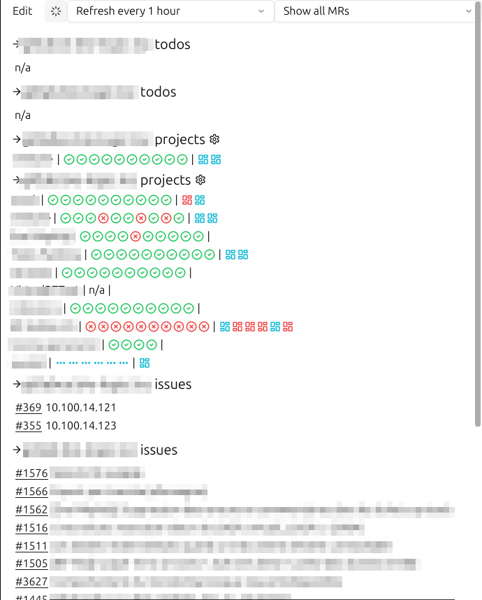

# 🚀 Roci (Rocinante)

Roci is an very opinionated dashboard to see your current work throught your differents Gitlab projects.

## Features

Show, in the same place:

- Last pipelines state on main branch of your projects
- Last merge_requests state of your projects
  - Red color: last pipeline failed
  - Blue: pending
  - Green: ready to merge
- Issues where you are assigned to
- Pending Todos



## Install

### Install from sources

Need some OS dependencies:

Ubuntu:

```
sudo apt update
sudo apt install -y \
  gcc g++ clang libfontconfig-dev libwayland-dev \
  libwebkit2gtk-4.1-dev libxkbcommon-x11-dev libx11-xcb-dev \
  libssl-dev libzstd-dev \
  vulkan-validationlayers libvulkan1
```

Windows:

```
Set-ExecutionPolicy -ExecutionPolicy RemoteSigned -Scope CurrentUser
Invoke-RestMethod -Uri https://get.scoop.sh | Invoke-Expression

winget install Microsoft.VisualStudio.2022.Community --silent --override "--wait --quiet --add ProductLang En-us --add Microsoft.VisualStudio.Workload.NativeDesktop --includeRecommended"
scoop bucket add extras
scoop install cmake
```

The, install from sources:

    cargo install --path crates/roci-app

Then run with `roci`.

## Integration

Example of `.desktop` file:

```
[Desktop Entry]
Version=1.0
Name=Roci
Comment=Gitlabs resume
Exec=/home/myusername/.cargo/bin/roci
Icon=/home/myusername/Images/Icons/rocinate_icon.png
Terminal=false
Type=Application
Categories=Utility;Development;
```

## TODO

- [ ] Github integration
